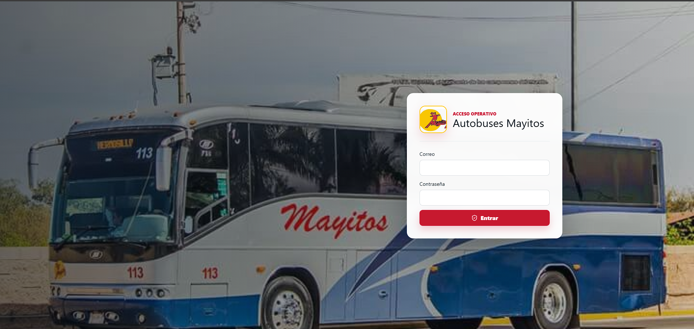
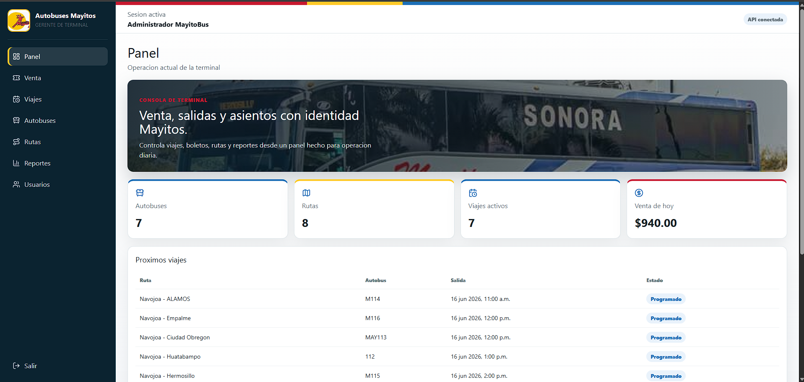
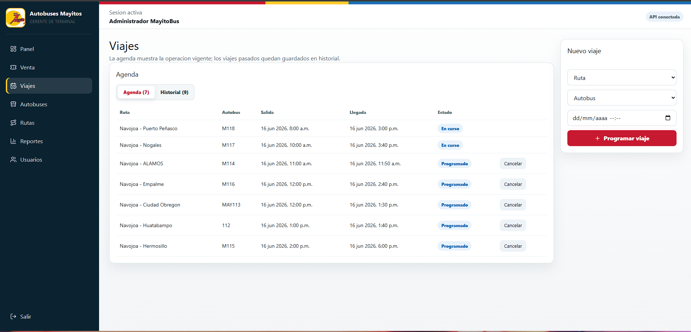
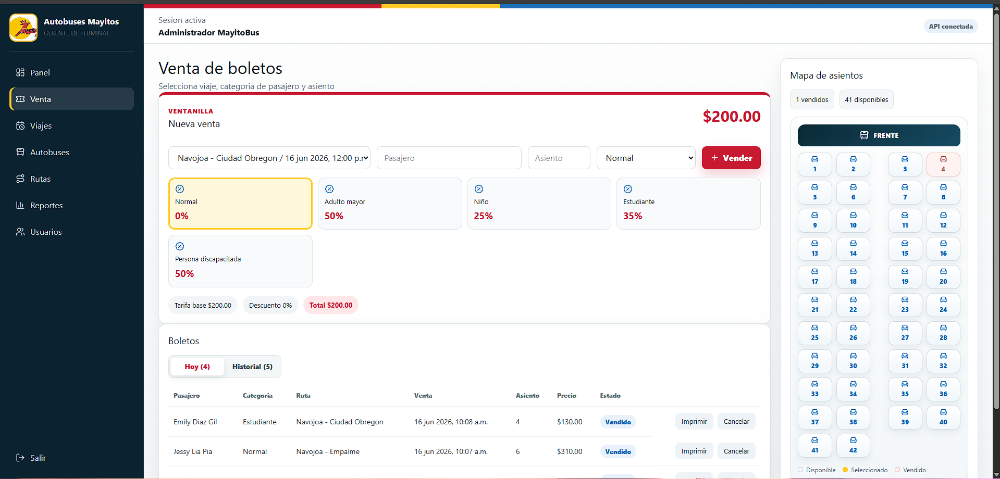
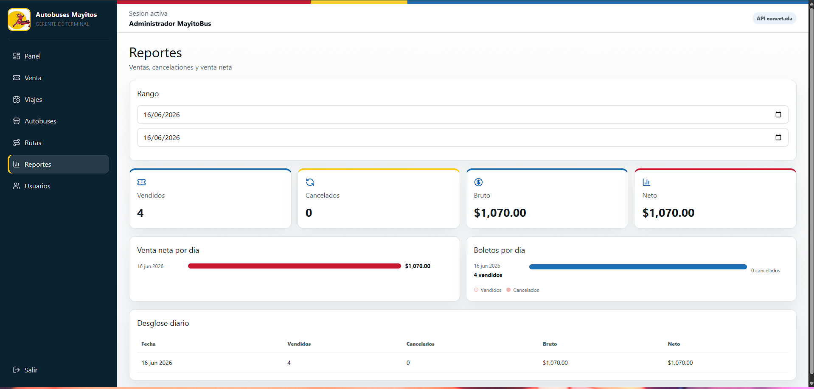

# Autobuses Mayitos

Sistema web full stack para la operacion de una terminal de Autobuses Mayitos. El proyecto incluye una API REST con Spring Boot y un panel administrativo en React para gestionar rutas, autobuses, viajes, venta de boletos, asientos, usuarios, reportes e impresion de comprobantes.

## Demo

Frontend publico:

```text
https://mayitobus-web.onrender.com
```

API publica:

```text
https://mayitobus-api.onrender.com
```

Nota: el plan gratuito de Render puede pausar la API por inactividad. La primera peticion despues de un tiempo sin uso puede tardar algunos segundos.

## Capturas

### Login



### Panel



### Agenda de viajes



### Venta de boletos y boleto imprimible



### Reportes



## Stack

- Java 21
- Spring Boot
- Maven
- PostgreSQL
- Flyway
- Spring Web
- Spring Data JPA
- Spring Security
- JWT
- React
- Vite
- TypeScript
- Axios
- TanStack Query
- Tailwind CSS
- Docker
- Render

## Funcionalidades

- Login con JWT.
- Roles `TERMINAL_MANAGER` y `TICKET_SELLER`.
- Gestion de usuarios con activacion y desactivacion.
- Gestion de autobuses con activacion y desactivacion.
- Gestion de rutas con activacion y desactivacion.
- Programacion y cancelacion de viajes.
- Separacion de agenda operativa e historial para viajes.
- Validacion de horarios para evitar que un autobus tenga viajes empalmados.
- Venta y cancelacion de boletos.
- Separacion de boletos del dia e historial.
- Categorias de boleto con descuento:
  - Normal: 0%
  - Nino: 25%
  - Estudiante: 35%
  - Adulto mayor: 50%
  - Persona discapacitada: 50%
- Control de asientos por viaje.
- Boleto imprimible.
- Reportes de ventas por rango de fechas con visualizacion diaria.
- Mensajes de validacion claros para orientar al usuario durante la captura.
- Despliegue con frontend, API y PostgreSQL en Render.

## Modelo de dominio

El sistema separa conceptos que en una version anterior estaban mezclados:

- Autobus: vehiculo fisico.
- Ruta: origen, destino, precio base y duracion estimada.
- Viaje: salida especifica en una fecha y hora, usando una ruta y un autobus.
- Boleto: venta de un asiento para un viaje.

Para conservar historial operativo, el sistema usa cambios de estado en lugar de eliminacion fisica: usuarios, autobuses y rutas se desactivan; los viajes y boletos se cancelan o se consultan desde historial.

## Credenciales demo

```text
Correo: admin@example.com
Password: password123
Rol: TERMINAL_MANAGER
```

Se recomienda usar estas credenciales solo para demostracion y cambiar los secretos en ambientes productivos.

## Configuracion local

### Backend

Ruta:

```text
mayitobus-api/
```

Crear una base de datos PostgreSQL:

```sql
CREATE DATABASE mayitobus_db;
```

Configurar variables de entorno:

```text
DB_URL=jdbc:postgresql://localhost:5432/mayitobus_db
DB_USERNAME=postgres
DB_PASSWORD=tu_password_de_postgres
JWT_SECRET=una_clave_larga_para_desarrollo_local
JWT_EXPIRATION_MINUTES=120
APP_TIME_ZONE=America/Hermosillo
CORS_ALLOWED_ORIGINS=http://localhost:5173,http://127.0.0.1:5173
```

Tambien puedes revisar el archivo de ejemplo:

```text
mayitobus-api/src/main/resources/application-example.properties
```

Para desarrollo local, puedes copiar ese ejemplo como `application-local.properties`. Ese archivo esta ignorado por Git para no subir contrasenas ni claves privadas.

Ejecutar desde IntelliJ IDEA:

```text
Run MayitobusApiApplication
```

O desde terminal:

```bash
cd mayitobus-api
./mvnw spring-boot:run
```

Health check:

```http
GET http://localhost:8080/api/health
```

### Frontend

Ruta:

```text
mayitobus-web/
```

Configurar variable de entorno opcional:

```text
VITE_API_URL=http://localhost:8080
```

Existe un archivo de ejemplo:

```text
mayitobus-web/.env.example
```

Instalar dependencias y ejecutar:

```bash
cd mayitobus-web
npm install
npm run dev
```

URL local:

```text
http://127.0.0.1:5173
```

## Docker

El proyecto incluye una configuracion Docker para levantar PostgreSQL, la API y el frontend con un solo comando.

Crear un archivo `.env` a partir del ejemplo:

```bash
copy .env.example .env
```

Levantar los servicios:

```bash
docker compose up --build
```

URLs:

```text
Frontend: http://localhost:5173
Backend:  http://localhost:8080
Postgres: localhost:5433
```

Para abrir el frontend desde otro dispositivo en la misma red, usa la IP local de tu computadora:

```text
http://TU_IP_LOCAL:5173
```

En Docker, el frontend usa el proxy de Nginx para enviar las llamadas `/api` al backend, por eso tambien funciona desde celular sin cambiar `localhost` en el navegador.

Detener los servicios:

```bash
docker compose down
```

Detener y borrar los datos de PostgreSQL del contenedor:

```bash
docker compose down -v
```

## Despliegue

El proyecto esta preparado para desplegarse como tres servicios:

- `mayitobus-web`: Static Site en Render.
- `mayitobus-api`: Web Service Docker en Render.
- `mayitobus-db`: PostgreSQL administrado en Render.

Variables principales para la API:

```text
DB_URL=jdbc:postgresql://HOST:5432/mayitobus_db?sslmode=require
DB_USERNAME=mayitobus_user
DB_PASSWORD=tu_password
JWT_SECRET=una_clave_larga_y_segura
JWT_EXPIRATION_MINUTES=120
APP_TIME_ZONE=America/Hermosillo
CORS_ALLOWED_ORIGINS=https://mayitobus-web.onrender.com
```

Variable principal para el frontend:

```text
VITE_API_URL=https://mayitobus-api.onrender.com
```

## Endpoints principales

```http
POST /api/auth/login

GET  /api/buses
POST /api/buses
PATCH /api/buses/{id}/deactivate
PATCH /api/buses/{id}/activate

GET  /api/routes
POST /api/routes
PATCH /api/routes/{id}/deactivate
PATCH /api/routes/{id}/activate

GET  /api/trips
POST /api/trips
PATCH /api/trips/{id}/cancel
GET  /api/trips/{id}/seats

GET  /api/tickets
POST /api/tickets
PATCH /api/tickets/{id}/cancel

GET  /api/users
POST /api/users
PATCH /api/users/{id}/deactivate
PATCH /api/users/{id}/activate

GET  /api/reports/sales?from=2026-06-12&to=2026-06-12
```

## Verificacion

Comandos recomendados antes de subir cambios:

```bash
cd mayitobus-api
./mvnw test
```

```bash
cd mayitobus-web
npm run lint
npm run build
```

## Estado

Proyecto de portafolio desplegado en Render. El flujo principal permite administrar catalogos, programar viajes, vender boletos con descuentos, controlar asientos, imprimir comprobantes, conservar historial operativo y consultar reportes.
